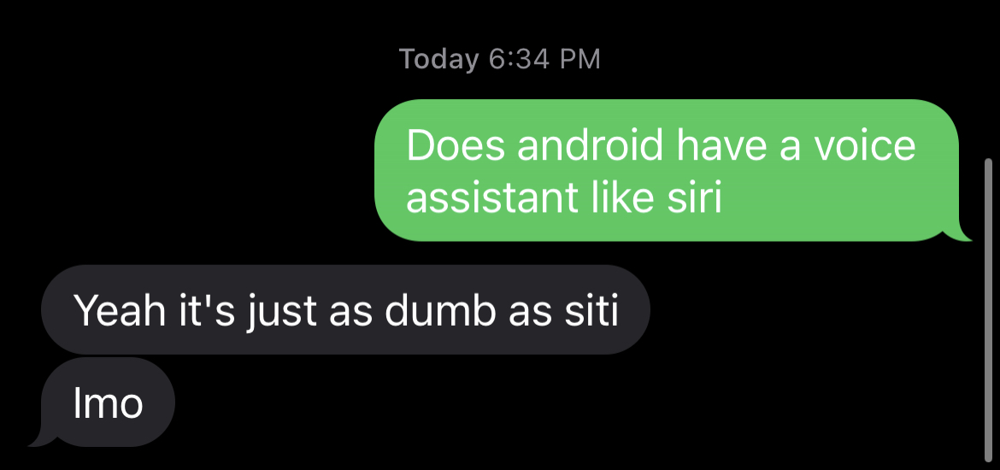

    <picture>
      <source media="(prefers-color-scheme: dark)" srcset="assets/ezgif.gif">
      
    </picture>
    <h1 align="center">TOP SECRET</h1>
    <h1 align="center">PROJECT KING BOB</h1>
    <h1 align="center">buddy</h1>

A digital AI assistant to free the world.

Siri, Alexa, Bixby are shitty and aren't useful. We can create something that changes the world through saving people priceless time and supporting them, acting as their guardian angel and buddy.